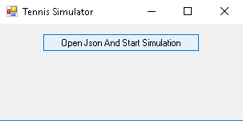

# TennisSimulator
## Project Description

Form project written in c#

## How To Start Project

### Installing Application And Starting.

Double Click on TennisSimulatorInstaller.msi
Select installation location when prompted.
Click next button and await installation to end.
You might be prompted to give administrative rights to installer select yes.
Once installation finishes go to installation folder.
Double click on TennisSimulator.exe.

You will see the screen on the above image.
Select Open Json And Start Simulation button.
You will be prompted to select a input JSON file.
Select json file then click ok.
Next you will be prompted to select where to save the output JSON file.
Select save location click ok.

### Installing Github Code And Starting in Debug Mode.

<pre>You will need visual studio 2017 or similar c# compiler</pre>

Double click on TennisSimulator.sln
Then select Run button from toolbar.

[!Screen](screen1.PNG)

You will see the screen on the above image.
Select Open Json And Start Simulation button.
You will be prompted to select a input JSON file.
Select json file then click ok.
Next you will be prompted to select where to save the output JSON file.
Select save location click ok.
